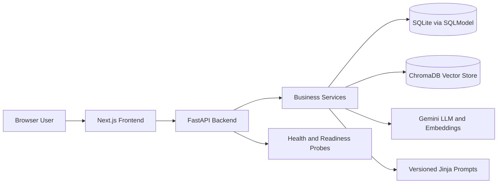
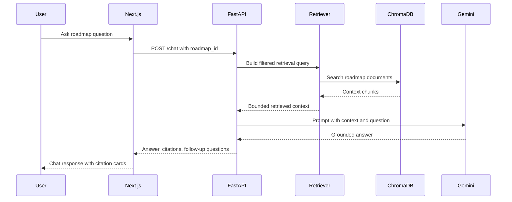

# Adaptive Learning AI

Adaptive Learning AI is a production-ready learning SaaS application. It generates a personalized
roadmap, recommends a portfolio project, answers roadmap-grounded questions with RAG citations, and
tracks learner progress across skills, tasks, and subtasks.

## Product Overview

The application is built for a recruiter-friendly demo flow:

1. Enter a learning goal, current experience, weekly hours, existing skills, and constraints.
2. Generate a sequenced roadmap with estimated hours, skills, tasks, subtasks, and completion criteria.
3. Generate a portfolio project from the roadmap or from a direct goal plus skills.
4. Ask RAG-backed questions against the generated roadmap and inspect citation cards.
5. Track completion percentage, completed skills, pending work, time spent, and estimated time remaining.

## Architecture Diagram



Detailed release docs are in [docs/architecture.md](docs/architecture.md),
[docs/api.md](docs/api.md), [docs/backend-design.md](docs/backend-design.md),
[docs/deployment.md](docs/deployment.md), and [docs/diagrams.md](docs/diagrams.md).

## Folder Structure

```text
.
├── backend
│   ├── app
│   │   ├── ai              # Gemini provider, structured generation, validation, cache, metrics
│   │   ├── api             # FastAPI routes, dependencies, error handlers
│   │   ├── config          # Pydantic settings and logging
│   │   ├── database        # SQLModel engine/session/init
│   │   ├── models          # Roadmap, project, chat, progress, resources, prompts, cache
│   │   ├── prompts         # Versioned prompt templates
│   │   ├── rag             # Chunking, documents, context, retrieval, Chroma indexing
│   │   ├── repositories    # SQL repository and unit of work
│   │   ├── schemas         # API request/response contracts
│   │   └── services        # Roadmap, project, chat, progress, resource orchestration
│   ├── tests               # Unit, RAG, repository, and API contract tests
│   └── Dockerfile
├── frontend
│   ├── app                 # Next.js routes and product pages
│   ├── components          # Layout, shared UI, shadcn-style primitives
│   ├── hooks               # Roadmap state hooks
│   ├── lib                 # API client, validation, storage, utilities
│   └── types               # Typed backend contracts
├── docs
│   ├── backend-design.md
│   ├── demo-walkthrough.md
│   └── diagrams.md
├── render.yaml
└── .github/workflows/ci.yml
```

## Tech Stack

- Frontend: Next.js 15, React 19, TypeScript, Tailwind CSS, Radix primitives, lucide-react
- Backend: FastAPI, SQLModel, Pydantic Settings, Alembic, Uvicorn
- AI: Gemini 2.5 Flash, Gemini Embedding 2, structured JSON generation, prompt repair, evaluation
- RAG: ChromaDB, roadmap document projection, chunking, filtered retrieval, citation responses
- Quality: Ruff, MyPy, Pytest, ESLint, TypeScript, Next build, GitHub Actions
- Deployment: Vercel for frontend, Render for backend, persistent Render disk for SQLite/Chroma/cache data

## AI Architecture

The backend uses a layered AI platform:

- `AIPlatform` builds Gemini generation, embedding, prompt management, Chroma retrieval, indexing, cache, and observability.
- Roadmap generation validates structured output before persistence and vector indexing.
- Project generation supports two exclusive modes: `roadmap_id` or direct `goal_title` plus `skills`.
- Chat uses roadmap-scoped retrieval and prompts the LLM to answer from bounded retrieved context.
- Evaluation, repair prompts, provider retries, response cache, and metrics paths are configured through environment variables.

## RAG Flow



## Database Design

Core persisted entities:

- `roadmaps`: learner goal, level, style, weekly hours, estimated hours, generation prompt version, index status
- `skills`, `tasks`, `subtasks`: ordered roadmap hierarchy with estimated effort and completion criteria
- `projects`, `project_skills`: generated project recommendations and normalized skill snapshots
- `conversations`, `messages`: roadmap-scoped chat history, citations, retrieval summary, model metadata
- `progress_records`: learner completion state and time spent for roadmap, skill, task, and subtask targets
- `learning_resources`: recommended resource records linked to roadmap, skill, or task
- `prompt_versions`, `cache`, `evaluation`: AI platform support tables for traceability and runtime quality

The local and Render deployment defaults use SQLite. The repository pattern keeps persistence isolated so
PostgreSQL can be introduced later without rewriting API handlers.

## API Endpoints

| Method | Path | Purpose |
| --- | --- | --- |
| `GET` | `/health` | Process health and deployment metadata |
| `GET` | `/health/live` | Liveness probe without dependency checks |
| `GET` | `/health/ready` | Database and service readiness |
| `POST` | `/roadmap` | Generate, persist, and index a personalized roadmap |
| `POST` | `/project` | Generate a project from roadmap or direct goal plus skills |
| `POST` | `/chat` | Ask a roadmap-grounded RAG question |
| `GET` | `/progress/{roadmap_id}` | Load progress statistics |
| `PATCH` | `/progress/{roadmap_id}` | Update progress for roadmap, skill, task, or subtask |
| `GET` | `/docs` | FastAPI OpenAPI UI |

## Local Setup

Backend:

```bash
cd backend
python -m venv .venv
.venv\Scripts\activate
pip install -e ".[dev]"
copy .env.example .env
alembic upgrade head
uvicorn app.main:app --reload
```

Frontend:

```bash
cd frontend
npm install
copy .env.example .env.local
npm run dev
```

Open the frontend at `http://localhost:3000` and the backend OpenAPI UI at
`http://localhost:8000/docs`.

## Environment Variables

Frontend:

| Variable | Required | Description |
| --- | --- | --- |
| `NEXT_PUBLIC_API_URL` | Yes | FastAPI base URL, for example `http://localhost:8000` |
| `NEXT_PUBLIC_APP_VERSION` | No | Version shown in Settings |

Backend:

| Variable | Required in production | Description |
| --- | --- | --- |
| `ALA_ENVIRONMENT` | Yes | Use `production` on Render |
| `ALA_GEMINI_API_KEY` | Yes | Gemini provider credential |
| `ALA_DATABASE_URL` | Yes | SQLite URL or future SQL database URL |
| `ALA_CORS_ALLOWED_ORIGINS` | Yes | JSON list of allowed frontend origins |
| `ALA_TRUSTED_HOSTS` | Yes | JSON list of allowed backend hostnames |
| `ALA_ALLOW_ANONYMOUS_LEARNER` | Yes | Must be `false` in production |
| `ALA_CHROMA_PATH` | Yes | Persistent ChromaDB path |
| `ALA_AI_CACHE_PATH` | No | Persistent response cache path |
| `ALA_AI_METRICS_PATH` | No | AI metrics JSONL path |

See `backend/.env.example`, `backend/.env.production.example`, `frontend/.env.example`, and
`frontend/.env.production.example`.

## Deployment Guide

Backend to Render:

- Use `render.yaml` from the repository root.
- Service root directory: `backend`
- Build command: `pip install --upgrade pip && pip install -r requirements.txt`
- Start command: `alembic upgrade head && uvicorn app.main:app --host 0.0.0.0 --port $PORT --proxy-headers`
- Health check path: `/health/ready`
- Persistent disk: `/opt/render/project/src/backend/data`
- Required secret: `ALA_GEMINI_API_KEY`
- Update `ALA_CORS_ALLOWED_ORIGINS` to the deployed Vercel origin.
- Update `ALA_TRUSTED_HOSTS` to the Render service hostname.

Frontend to Vercel:

- Project root directory: `frontend`
- Install command: `npm ci`
- Build command: `npm run build`
- Output: Next.js default managed by Vercel
- Environment variables:
  - `NEXT_PUBLIC_API_URL=https://adaptive-learning-ai-api.onrender.com`
  - `NEXT_PUBLIC_APP_VERSION=0.1.0`

## Verification

Backend:

```bash
cd backend
ruff check .
mypy app
pytest
alembic upgrade head
python -m build
```

Frontend:

```bash
cd frontend
npm run lint
npm run type-check
npm test
npm run build
```

CI runs the same checks in `.github/workflows/ci.yml`.

## Screenshots To Capture

- Home: recruiter-facing product overview and architecture summary
- Roadmap: generated roadmap with expanded skill, task, and subtask hierarchy
- Project: roadmap-mode and direct-mode project recommendation
- Chat: RAG answer with retrieved context indicator and citation cards
- Progress: completion percentage, completed skills, pending skills, and time remaining
- Settings: backend URL, model information, application version, and health status

## Demo

Use [docs/demo-walkthrough.md](docs/demo-walkthrough.md) for a 3-5 minute walkthrough, talking
points, architecture explanation, and interview framing.

## Future Improvements

- Add authenticated learner accounts and team workspaces.
- Add PostgreSQL deployment profile for high-concurrency production workloads.
- Expose learning resource CRUD endpoints in the frontend.
- Add server-sent event streaming for chat tokens.
- Add visual regression tests for the frontend route set.
- Add admin observability dashboards for prompt quality, token usage, and retrieval quality.

## AI Tools Used

- Gemini is the runtime LLM and embedding provider.
- Codex was used as an implementation assistant for the final frontend, deployment, CI, and docs pass.

## Time Spent

The repository does not store an authoritative personal time log. The final release-candidate pass
completed production review, deployment migration wiring, CI alignment, documentation updates, and
full backend/frontend verification.
