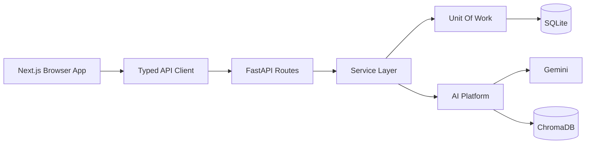
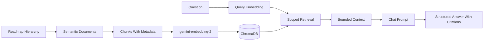

# Architecture

Adaptive Learning AI is a full-stack learning application with a Next.js frontend and a FastAPI
backend.

## Components

- **Frontend:** Next.js App Router pages for Home, Roadmap, Project, Chat, Progress, Settings, and
  Not Found. A shared Axios client handles API calls, retries, learner identity headers, and friendly
  errors.
- **Backend:** FastAPI routes, service classes, repository/unit-of-work persistence, SQLModel models,
  Alembic migrations, structured logging, payload limits, CORS, and trusted-host middleware.
- **AI Platform:** Gemini structured generation, prompt management, JSON validation, repair,
  quality evaluation, embeddings, ChromaDB retrieval, context building, cache, and metrics sink.
- **Persistence:** SQLite is the source of record; ChromaDB is a rebuildable vector projection.

## Request Flow

## RAG Flow

The chat prompt receives retrieved chunks only, not the entire roadmap.
