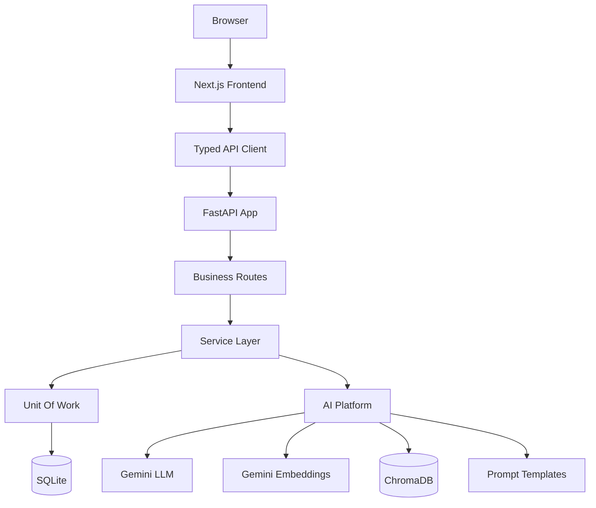
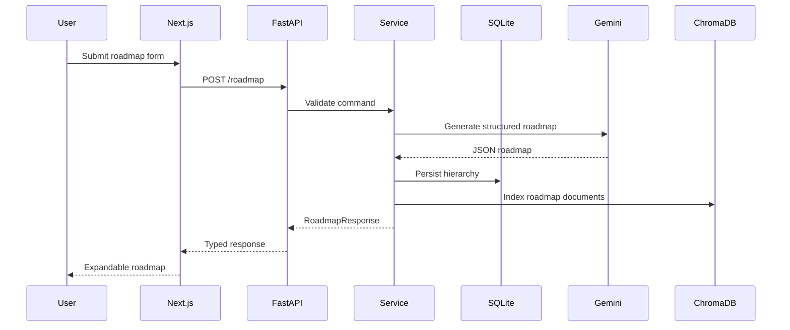
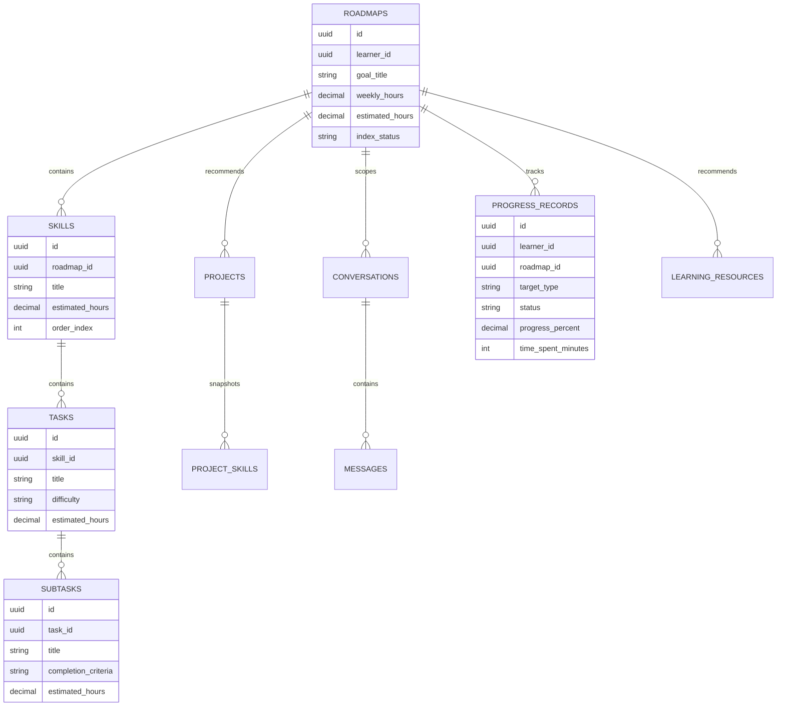
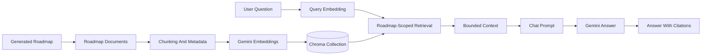
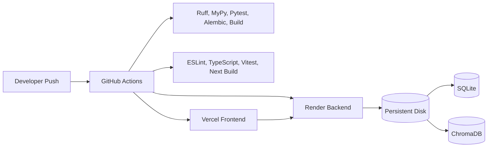
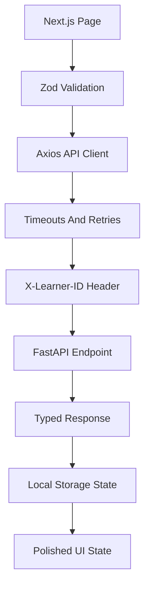

# Architecture And Flow Diagrams

## System Architecture

```mermaid
flowchart TB
  Browser[Browser] --> Next[Next.js Frontend]
  Next --> Client[Typed API Client]
  Client --> FastAPI[FastAPI App]
  FastAPI --> Routes[Business Routes]
  Routes --> Services[Service Layer]
  Services --> UOW[Unit Of Work]
  UOW --> SQLite[(SQLite)]
  Services --> AI[AI Platform]
  AI --> Gemini[Gemini LLM]
  AI --> Embeddings[Gemini Embeddings]
  AI --> Chroma[(ChromaDB)]
  AI --> Prompts[Prompt Templates]
```

## Request Sequence

```mermaid
sequenceDiagram
  participant User
  participant Web as Next.js
  participant API as FastAPI
  participant Service
  participant DB as SQLite
  participant AI as Gemini
  participant Vector as ChromaDB

  User->>Web: Submit roadmap form
  Web->>API: POST /roadmap
  API->>Service: Validate command
  Service->>AI: Generate structured roadmap
  AI-->>Service: JSON roadmap
  Service->>DB: Persist hierarchy
  Service->>Vector: Index roadmap documents
  Service-->>API: RoadmapResponse
  API-->>Web: Typed response
  Web-->>User: Expandable roadmap
```

## Entity Relationship Diagram

```mermaid
erDiagram
  ROADMAPS ||--o{ SKILLS : contains
  SKILLS ||--o{ TASKS : contains
  TASKS ||--o{ SUBTASKS : contains
  ROADMAPS ||--o{ PROJECTS : recommends
  PROJECTS ||--o{ PROJECT_SKILLS : snapshots
  ROADMAPS ||--o{ CONVERSATIONS : scopes
  CONVERSATIONS ||--o{ MESSAGES : contains
  ROADMAPS ||--o{ PROGRESS_RECORDS : tracks
  ROADMAPS ||--o{ LEARNING_RESOURCES : recommends

  ROADMAPS {
    uuid id
    uuid learner_id
    string goal_title
    decimal weekly_hours
    decimal estimated_hours
    string index_status
  }

  SKILLS {
    uuid id
    uuid roadmap_id
    string title
    decimal estimated_hours
    int order_index
  }

  TASKS {
    uuid id
    uuid skill_id
    string title
    string difficulty
    decimal estimated_hours
  }

  SUBTASKS {
    uuid id
    uuid task_id
    string title
    string completion_criteria
    decimal estimated_hours
  }

  PROGRESS_RECORDS {
    uuid id
    uuid learner_id
    uuid roadmap_id
    string target_type
    string status
    decimal progress_percent
    int time_spent_minutes
  }
```

## RAG Flow Diagram

```mermaid
flowchart LR
  Roadmap[Generated Roadmap] --> Documents[Roadmap Documents]
  Documents --> Chunks[Chunking And Metadata]
  Chunks --> Embeddings[Gemini Embeddings]
  Embeddings --> Chroma[(Chroma Collection)]
  Question[User Question] --> QueryEmbedding[Query Embedding]
  QueryEmbedding --> Retrieval[Roadmap-Scoped Retrieval]
  Chroma --> Retrieval
  Retrieval --> Context[Bounded Context]
  Context --> Prompt[Chat Prompt]
  Prompt --> LLM[Gemini Answer]
  LLM --> Response[Answer With Citations]
```

## Deployment Diagram

```mermaid
flowchart LR
  Dev[Developer Push] --> GitHub[GitHub Actions]
  GitHub --> BackendChecks[Ruff, MyPy, Pytest, Alembic, Build]
  GitHub --> FrontendChecks[ESLint, TypeScript, Vitest, Next Build]
  GitHub --> Render[Render Backend]
  GitHub --> Vercel[Vercel Frontend]
  Render --> Disk[(Persistent Disk)]
  Disk --> SQLite[(SQLite)]
  Disk --> Chroma[(ChromaDB)]
  Vercel --> Render
```

## Frontend Request Flow

```mermaid
flowchart TD
  Page[Next.js Page] --> Validation[Zod Validation]
  Validation --> Client[Axios API Client]
  Client --> Retry[Timeouts And Retries]
  Retry --> Headers[X-Learner-ID Header]
  Headers --> API[FastAPI Endpoint]
  API --> Typed[Typed Response]
  Typed --> Storage[Local Storage State]
  Storage --> UI[Polished UI State]
```
